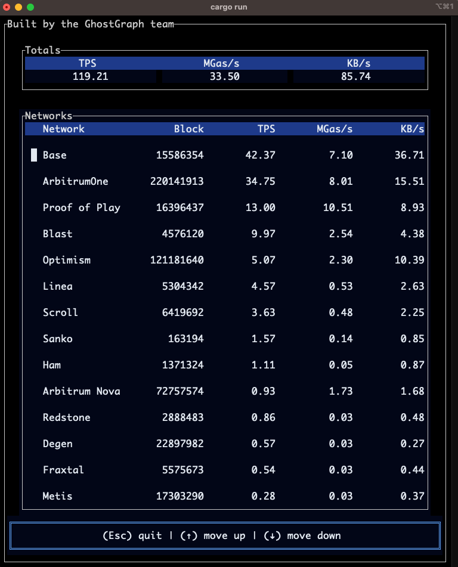

# rollup-tui

We created a terminal user interface heavily inspired by [Rollups](https://rollup.wtf/)

### Usage

```shell
cargo run
```



### Adding networks

You can add a network by editing `config/networks.json` and specifying the network name, label, and an RPC endpoint

## License

[MIT](./LICENSE)
